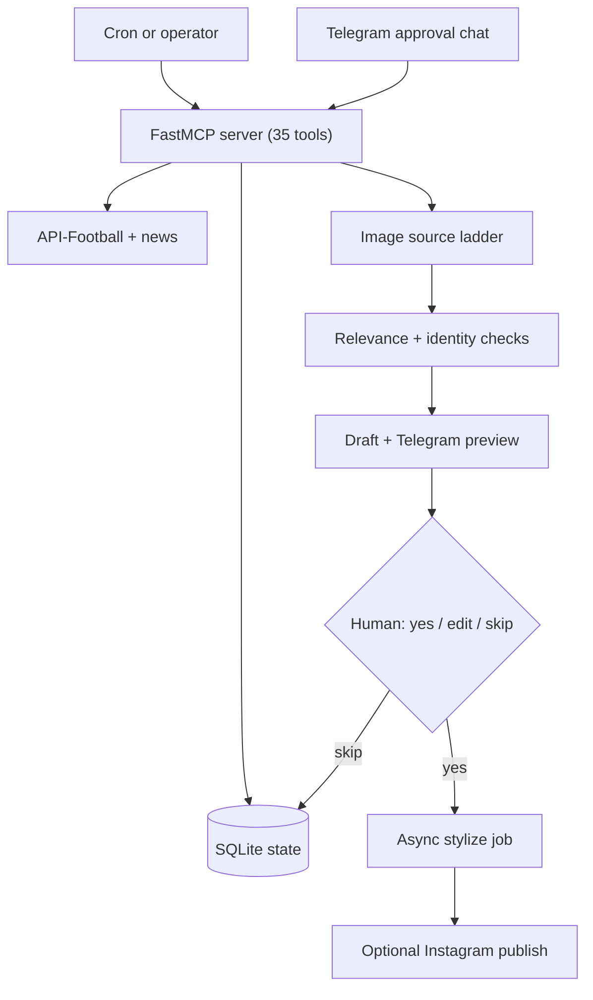

<div align="center">

# Football Content Agent

**A football content brand that runs itself, end to end, with a human on the
publish button.** Live in production as [@mandemfchq](https://www.instagram.com/mandemfchq/):
it watches fixtures and news, drafts opinionated posts with match graphics, and
publishes only after approval over Telegram.

[](https://github.com/mirasolutions06/football-content-agent/actions/workflows/ci.yml)
[](LICENSE)


[](https://www.instagram.com/mandemfchq/)


[Architecture](ARCHITECTURE.md) · [Runbook](RUNBOOK.md) · [The engine it runs on](https://github.com/mirasolutions06/ai-social-content-agent)

</div>

## At a glance

This repo is the live football implementation of the reusable
[`ai-social-content-agent`](https://github.com/mirasolutions06/ai-social-content-agent)
engine. It shows the engine connected to real football inputs: fixtures, news,
lineups, player imagery, Telegram approval, and optional Instagram publishing.

| Path | What it contains |
|---|---|
| `scripts/mandem_mcp.py` | MCP tool server for football content workflows. |
| `scripts/mandem/` | Football APIs, news ranking, captions, imagery, Telegram, and publishing. |
| `FAILURE_MODES.md` | Public notes on data/provider failures and graceful fallback behavior. |
| `ARCHITECTURE.md` | System design and approval-flow notes. |
| `RUNBOOK.md` | Setup and operating checklist. |
| `scripts/tests/` | No-secret tests for captions, season mode, image rules, and safety checks. |

## Why this exists

This is the **production proof** for the
[ai-social-content-agent](https://github.com/mirasolutions06/ai-social-content-agent)
engine: the same approval-gated, human-in-the-loop core, specialized for football
and running live for a real audience. The engine repo is the reusable version;
this repo shows it holding up in the wild.

The interesting part is not "generate a caption." It is the operating system
around that caption: event polling, ranking, state, an approval gate, async media
jobs, image safety checks, deterministic fallbacks, and recovery when a provider
fails or live data goes missing.

## What it proves

| | |
|---|---|
| **Runs live** | Deployed and posting as [@mandemfchq](https://www.instagram.com/mandemfchq/). |
| **35 MCP tools** | Fixtures, news ranking, image sourcing, drafts, approval, stylization, publishing. |
| **Human-in-the-loop** | Every draft is approved over Telegram before it can publish. |
| **Safe imagery** | An image-source ladder (official photos, news, Wikimedia, Pexels, generation) with identity and relevance checks. |
| **Fails gracefully** | Deterministic Pillow composites when providers fail or mutate an image. |
| **Real coverage** | 67 passing tests, run in CI. |

## How it works



Full detail in [ARCHITECTURE.md](ARCHITECTURE.md). The generic, reusable engine
behind this lives in
[ai-social-content-agent](https://github.com/mirasolutions06/ai-social-content-agent).

## Quick start

```bash
python3 -m venv .venv && . .venv/bin/activate
make install
make test          # 67 tests, no live secrets needed
cp .env.example .env
make db-init
```

## Built with

Python · [MCP](https://modelcontextprotocol.io) (FastMCP) · SQLite · API-Football ·
Telegram Bot API · Instagram Graph API · fal.ai / OpenAI image models.

## Public-safe notes

A sanitized proof repo. It excludes private workspace memory, live hostnames, IPs,
chat IDs, secrets, and deployment-specific paths. Keep real credentials in `.env`
locally or in a server env file outside git.

## License

MIT, see [LICENSE](LICENSE). Use it as a reference implementation for your own
human-approved content workflow.

## Contact

Built and operated by Mira Solutions, an AI engineering and automation studio.

mira.solutions06@gmail.com
